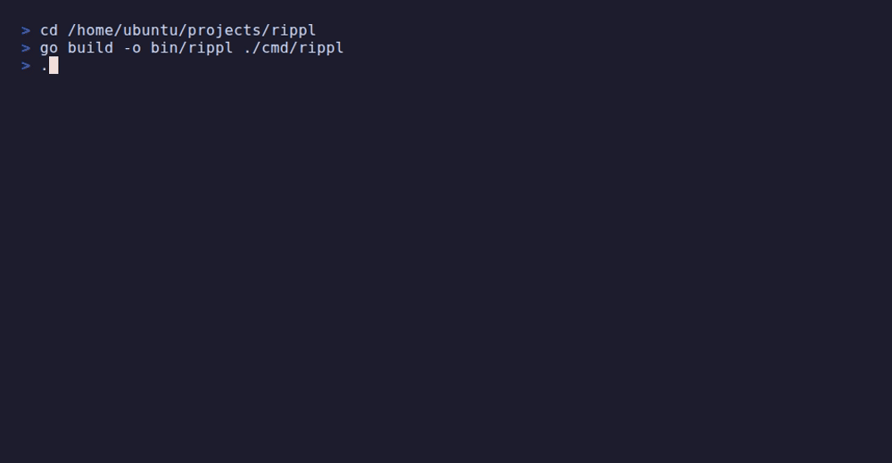
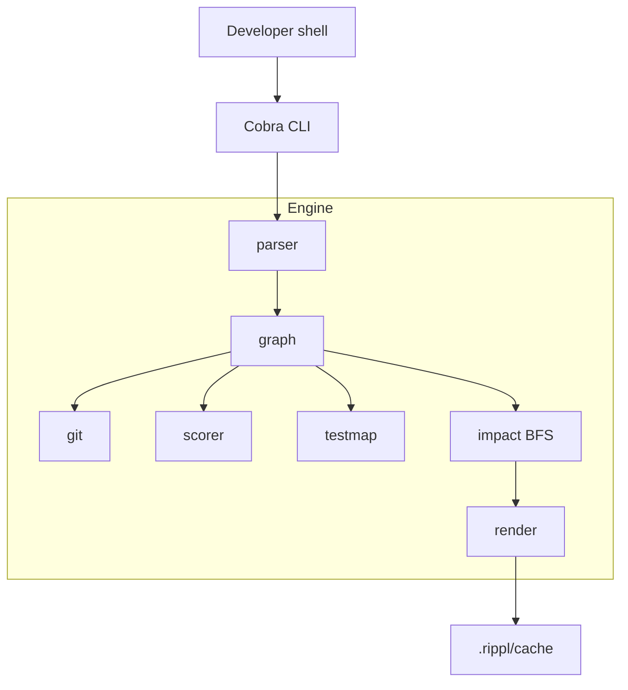

# Rippl

Go CLI for change impact analysis in Go modules — see which files a change affects, how risky they are, and which tests to run.



## Install

Requires [Go 1.22+](https://go.dev/dl/).

```bash
go install github.com/anggasct/rippl/cmd/rippl@latest
```

Or build from source:

```bash
git clone https://github.com/anggasct/rippl.git
cd rippl
go build -o rippl ./cmd/rippl
```

## Quick start

From the root of any Go module:

```bash
# Impact analysis (TUI when stdout is a terminal; use --format text in scripts)
rippl analyze internal/auth/jwt.go

# Risk score breakdown
rippl score internal/auth/jwt.go

# Run tests in packages affected by a change
rippl test internal/auth/jwt.go

# Export the full dependency graph
rippl graph --format mermaid
```

Export formats for `analyze` and `graph`:

```bash
rippl analyze handler.go --format json
rippl analyze handler.go --format mermaid
rippl graph --format json
```

## Usage

Run `rippl` from the root of a Go module. Commands that take a file argument require a **path to a `.go` file** (not a directory).

| Command | Arguments | Description |
|---------|-----------|-------------|
| `rippl analyze` | `<file>` | Blast radius, risk scores, and test status per affected file |
| `rippl score` | `<file>` | Six-signal risk breakdown for one file |
| `rippl test` | `<file>` | Run `go test` in packages affected by a change |
| `rippl graph` | — | Export the full module dependency graph |
| `rippl version` | — | Print version |

Run `rippl <command> --help` for full flag details.

### Global flags

| Flag | Default | Description |
|------|---------|-------------|
| `--format` | `tui` on a TTY, `text` when piped | Output format: `tui`, `text`, `json`, `mermaid` |
| `--max-depth` | `3` | Impact traversal depth (BFS hops) |
| `--since` | `12 months` | Git history window for risk signals |
| `--no-cache` | `false` | Force a cold rebuild of the dependency graph |
| `--config` | `.rippl.yaml` | Config file path (relative to module root) |
| `--no-color` | auto | Disable ANSI colors |

**Formats by command:**

- `analyze` — all formats (`tui` default on a terminal)
- `score`, `test` — text output to stdout
- `graph` — `mermaid` (default), `json`; `text` / `tui` fall back to mermaid

### Command flags

| Command | Flag | Description |
|---------|------|-------------|
| `analyze`, `score`, `test`, `graph` | `--no-cache` | Force cold graph build (also available as a global flag) |
| `graph` | `--package <prefix>` | Limit export to a package subgraph |

### Interactive TUI

When stdout is a terminal, `rippl analyze <file>` opens an interactive UI (override with `--format text` or `--format json` for scripts).

| Key | Action |
|-----|--------|
| ↑ / ↓, `j` / `k` | Move selection (works in list and detail views) |
| PgUp / PgDn, Ctrl+U / Ctrl+D | Scroll the viewport |
| Mouse wheel | Scroll the list |
| `d` | Toggle detail panel for the selected file |
| `Esc` | Close detail panel |
| `q` | Quit |

The footer shows your position as `N/total` affected files.

### Tips

- **Scripts and CI:** use `--format json` for machine-readable output, or `--format text` for a short summary.
- **Long text output:** `analyze --format text` shows up to 20 affected files, then `... and N more`; JSON always includes the full list.
- **Config:** optional `.rippl.yaml` at module root.
- **Cache:** graph cache lives under `.rippl/cache/` — add `.rippl/` to `.gitignore`.

## Architecture



Commands: `analyze` | `score` | `test` | `graph`

## Known limits

| Limitation | Behavior |
|------------|----------|
| Dynamic calls / reflection | Not tracked; may miss edges |
| Implicit interface satisfaction | Not tracked yet |
| Generated code | Ignored via config patterns |
| Cross-module internal deps | Module boundary only |

## Changelog

See [CHANGELOG.md](CHANGELOG.md) for release history. Install a specific version:

```bash
go install github.com/anggasct/rippl/cmd/rippl@v0.1.0
```

## Contributing

See [CONTRIBUTING.md](CONTRIBUTING.md) for development setup and how to send pull requests.

## License

MIT — see [LICENSE](LICENSE).
