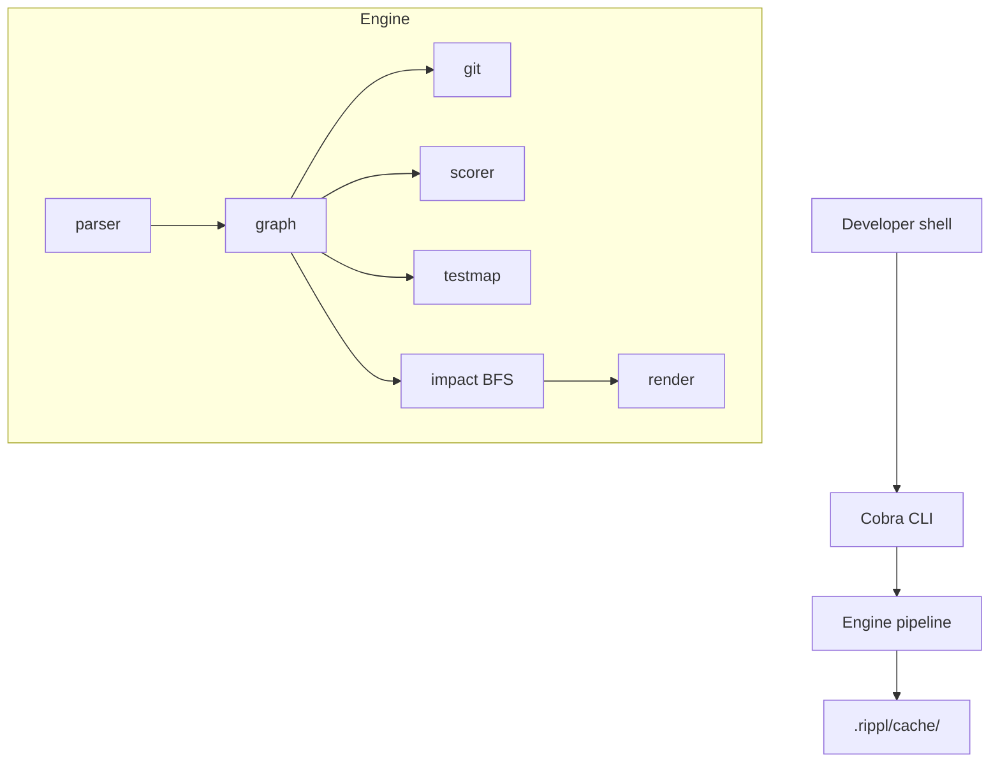

# Rippl

Go CLI for change impact analysis in Go modules — see which files a change affects, how risky they are, and which tests to run.


## Install

Requires [Go 1.22+](https://go.dev/dl/).

```bash
go install github.com/anggasct/rippl/cmd/rippl@latest
```

Or build from source:

```bash
git clone https://github.com/anggasct/rippl.git
cd rippl
go build -o rippl ./cmd/rippl
```

## Quick start

From the root of any Go module:

```bash
# Impact analysis (TUI when stdout is a terminal; use --format text in scripts)
rippl analyze internal/auth/jwt.go

# Risk score breakdown
rippl score internal/auth/jwt.go

# Run tests in packages affected by a change
rippl test internal/auth/jwt.go

# Export the full dependency graph
rippl graph --format mermaid
```

Export formats for `analyze` and `graph`:

```bash
rippl analyze handler.go --format json
rippl analyze handler.go --format mermaid
rippl graph --format json
```

Optional config: `.rippl.yaml` at module root. Graph cache is stored under `.rippl/cache/` — add `.rippl/` to your `.gitignore`.

## Architecture



Commands: `analyze` | `score` | `test` | `graph`

## Known limits

| Limitation | Behavior |
|------------|----------|
| Dynamic calls / reflection | Not tracked; may miss edges |
| Implicit interface satisfaction | Not tracked yet |
| Generated code | Ignored via config patterns |
| Cross-module internal deps | Module boundary only |

## Changelog

See [CHANGELOG.md](CHANGELOG.md) for release history. Install a specific version:

```bash
go install github.com/anggasct/rippl/cmd/rippl@v0.1.0
```

## Contributing

See [CONTRIBUTING.md](CONTRIBUTING.md) for development setup and how to send pull requests.

## License

MIT — see [LICENSE](LICENSE).
